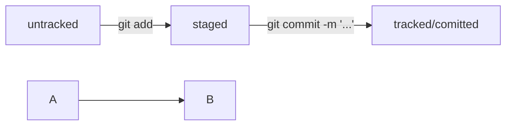

# Шпора

## Базовые команды консоли

### Навигация

```bash
pwd
``` (от англ. print working directory, «показать рабочую папку») — покажи, в какой я папке;


```bash
ls
```
 (от англ. list directory contents, «отобразить содержимое директории») — покажи файлы и папки в текущей папке;


```bash
ls -a
```
 покажи также скрытые файлы и папки, названия которых начинаются с символа .;


```bash
cd first-project
```
(от англ. change directory, «сменить директорию») — перейди в папку first-project;


```bash
cd first-project/html
```
 перейди в папку html, которая находится в папке first-project;


```bash
cd ..
```
 перейди на уровень выше, в родительскую папку;


```bash
cd ~
```
 перейди в домашнюю директорию (/Users/Username);


```bash
cd /
```
 перейди в корневую директорию.


### Работа с файлами и папками

#### Создание

*touch* index.html (англ. touch, «коснуться») — создай файл index.html в текущей папке;
*touch index.html style.css script.js* — если нужно создать сразу несколько файлов, можно напечатать их имена в одну строку через пробел;
*mkdir second-project* (от англ. make directory, «создать директорию») — создай папку с именем second-project в текущей папке.

#### Копирование и перемещение

*cp file.txt ~/my-dir* (от англ. copy, «копировать») — скопируй файл в другое место;
*mv file.txt ~/my-dir* (от англ. move, «переместить») — перемести файл или папку в другое место.

#### Чтение

*cat file.txt* (от англ. concatenate and print, «объединить и распечатать») — распечатай содержимое текстового файла file.txt.

#### Удаление

*rm about.html* (от англ. remove, «удалить») — удали файл about.html;
*rmdir images* (от англ. remove directory, «удалить директорию») — удали папку images;
*rm -r second-project* (от англ. remove, «удалить» + recursive, «рекурсивный») — удали папку second-project и всё, что она содержит.


### Полезные возможности

*&&* - перечислить несколько команд

---

## Работа с репозиторием


```bash
Git init
``` Сделать папку репозиторием

```bash
rm -rf .git
``` разгитить папку

ключ -r (от англ. recursive — «рекурсивно») позволяет удалять папки вместе с их содержимым;
ключ -f (от англ. force — «заставить») избавит вас от вопросов вроде «Вы точно хотите удалить этот файл? А этот? И этот тоже?».


```bash
Git status
``` статус

```bash
git add --all
``` добавить в репозиторий
 --all позволяет подготовить к сохранению все файлы в репозитории.
git add . - всю текущую папку


```bash
git commit -m 'коммент'
``` закоммитить изменения (сохр в истории изменений)

```bash
git log
``` история комиков

```bash
git remote add origin git@github.com:%ИМЯ_АККАУНТА%/first-project.git
``` связать локальный и удаленный репозитории

```bash
git remote -v
``` -v короткая форма флага --verbose (англ. «подробный»). Он позволяет показать больше информации в выводе.

```bash
git push -u origin main
``` - первая загрузка содержимого локального репозитория на GitHub (далее без флага -u)


```bash
git log --oneline
``` одной строкой (автоматически подбирает такую длину сокращённых хешей, чтобы они были уникальными в пределах репозитория и Git)

*HEAD* - обозначение последнего коммита

Пример: commit *408e992dbc6af7d0d3811424ec83135ee1a9b0ea* - это хеш, уникальный идентификатор коммита, содержит инфу о дате, авторе, изменениях. Всегда один и тот же, если файл не менялся. Хоть одно изменение - хеш поменяется

## Статусы файлов

Untracked (git видит, но не следит) -> Staged/indexed/cached (после команды git Add)
Tracked - добавленные и/или закоммиченные
Modified - измененные (если изменен после команды Add)


ЖЦ статусов:

1. Файл только что создали. Git ещё не отслеживает содержимое этого файла. Состояние: untracked.
2. Файл добавили в staging area с помощью git add. Состояние: staged (+ tracked).
-  Возможно, изменили файл ещё раз. Состояния: staged, modified (+ tracked).
Обратите внимание: staged и modified у одного файла, но у разных его версий.
-  Ещё раз выполнили git add. Состояние: staged (+ tracked).
3. Сделали коммит с помощью git commit. Состояние: tracked.
4. Изменили файл. Состояние: modified (+ tracked).
5. Снова добавили в staging area с помощью git add. Состояния: staged (+ tracked).
6. Сделали коммит. Состояния: tracked.
7. Повторили пункты 4−7 много-много раз.




[Link1](https://www.ya.ru) 
[Link2](https://www.ya.ru "ссылка на поиск!") 